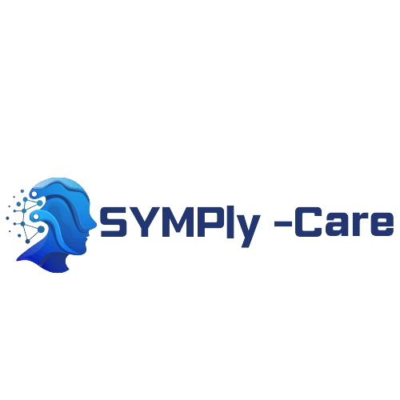

## 🧩 About the Frontend

The **Symply-Care Frontend** is a React-based web application that serves as the main user interface for the Symply-Care platform. It allows users to book appointments, submit inquiries, and interact with healthcare services provided by the system.

This frontend communicates with the backend via RESTful APIs and displays dynamic content based on the user's actions and roles. It also supports containerized deployment using Docker and Kubernetes, making it suitable for modern cloud-native environments.





<table align="center">
  <tr>
    <td align="center" width="33%">
      <a href="https://github.com/Ezratarab/symply-care-springBoot-backend">
        
      </a>
      <br>
      <sub><b>API & Data Management</b></sub>
      <br>
      <sub>Java • Spring Boot • MySQL • RabbitMQ</sub>
    </td>
    <td align="center" width="33%">
      <a href="[https://github.com/Ezratarab/symply-care-react-frontend]">
        
      </a>
      <br>
      <sub><b>User Interface</b></sub>
      <br>
      <sub>React • Next.js • TypeScript • Tailwind</sub>
    </td>
    <td align="center" width="33%">
      <a href="[https://github.com/Ezratarab/symply-care-ML]">
        
      </a>
      <br>
      <sub><b>Predictive Engine</b></sub>
      <br>
      <sub>Python • Scikit-learn • TensorFlow • RabbitMQ</sub>
    </td>
  </tr>
</table>
---

## 🛠 Technologies Used

- **ReactJS**
- **JavaScript (ES6+)**
- **React Router** – Page routing
- **Axios** – API requests
- **Redux** – State management
- **Docker** – Containerization
- **Kubernetes** – Deployment

---

## 🚀 Getting Started

### Clone the repository

```bash
git clone https://github.com/Ezratarab/symply-care-react-frontend.git
cd symply-care-react-frontend
```

### Install dependencies

```bash
npm install
```

### Run the development server

```bash
npm start
```

The app will be available at [http://localhost:3000](http://localhost:3000)

---

## 🐳 Docker Deployment

### Build the Docker image

```bash
docker build -t symply-care-frontend .
```

### Run the Docker container

```bash
docker run -p 3000:3000 symply-care-frontend
```

---

## ☸️ Kubernetes Deployment

Make sure your cluster is set up, then apply the manifests:

```bash
kubectl apply -f kubernetes/deployment-frontend.yaml
kubectl apply -f kubernetes/service-frontend.yaml
```

---

## 🔗 Connecting to Backend

Update the `.env` file with your backend URL:

```env
REACT_APP_API_URL=http://localhost:8080
```

If you're using RabbitMQ through frontend as well (if needed):

```env
REACT_APP_RABBITMQ_URL=amqp://localhost
```

---

## 🧪 Running Tests

```bash
npm test
```

---

## 📚 About the Project

**Symply-Care Frontend** is the client-facing React app of the Symply-Care system. It connects to a Spring Boot backend and optionally communicates with a machine learning service through RabbitMQ. The UI supports appointments, inquiries, and healthcare-related features.

It is fully dockerized and ready for Kubernetes deployment, making it suitable for modern cloud environments.

---
## 🔗 Part of the Symply-Care Project

This repository is one of the three main components of the full Symply-Care system:

🔙 Backend (Spring Boot) – Handles API logic, DB management, and RabbitMQ integration.

💻 Frontend (React) – The UI application you are currently viewing.

🧠 Machine Learning Service (Flask) – Processes ML predictions via RabbitMQ.

---

## 🤝 Contributing

1. Fork this repository
2. Create a new branch (`feature/xyz`)
3. Commit your changes
4. Open a Pull Request

---

## 📄 License

This project is licensed under the MIT License.
